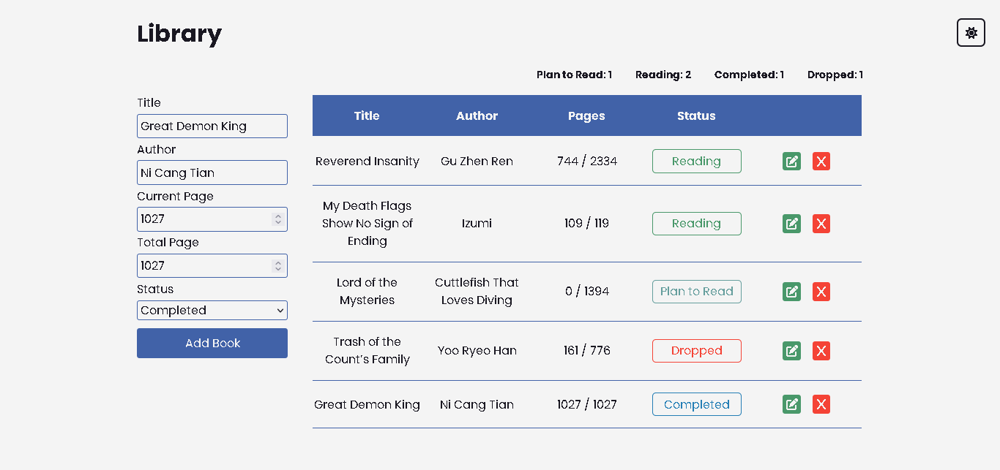

# Library

Library Project made with HTML, CSS, and Javscript for The Odin Project Javascript Path

### Preview

### Links

- The Odin Project: [https://www.theodinproject.com/](https://www.theodinproject.com/)

- Live Demo: [https://nevz9.github.io/etch-a-sketch/](https://nevz9.github.io/library)

### Built with

- HTML5 and CSS3
- Javascript

###

This really highlighted my lack of knowledge with OOP. This was a great learning experience and will definitely strive to have better knowledge in OOP before moving forward in the course.

It's kind of messy right now, I'll come back to it later to try and optimize the code.
